 
# 🚗 AutoLog.AI  

> *Smart Vehicle Management with AI, OCR & Automation*  
> Developed with ❤️ by **Saad Bin Khalid**

---

## 🧠 Overview  
**AutoLog.AI** is a next-generation smart vehicle management platform designed to simplify car maintenance and expense tracking.  
From **fuel logs** to **service reminders**, **AI chatbot assistance (Nex)** to **OCR receipt scanning**, AutoLog.AI blends intelligence with usability — making car care effortless and futuristic.  

---

## ✨ Core Features  
- 🔐 **Authentication System** – Secure Signup/Login with JWT  
- 💬 **AI Assistant (Nex)** – Powered by Google Gemini API for smart vehicle insights  
- 🧾 **OCR Receipt Scanner** – Extract data from fuel/service receipts using Tesseract.js  
- 🛠️ **Service Reminders** – Automatic alerts for upcoming maintenance  
- ⛽ **Fuel Log Tracker** – Record and view all your fuel expenses  
- 🧑‍💻 **Admin Dashboard** – Manage users, logs, and analytics with Flask-Admin  
- 📧 **Email System** – OTP verification & service updates using Flask-Mail  
- ⚙️ **Terms & Privacy Policies** – Legally clean and user-transparent  
- 🪄 **Modern UI** – Angular + Tailwind + Glassmorphism-based design  

---

## 🧩 Tech Stack  

| Category | Technologies |
|-----------|---------------|
| **Frontend** | Angular, TypeScript, TailwindCSS |
| **Backend** | Flask, Flask-JWT, Flask-Mail, Flask-Admin |
| **AI & NLP** | Google Gemini API |
| **Database** | SQLite |
| **OCR** | Tesseract.js |
| **Version Control** | Git & GitHub |

---

## 📸 Screenshots  

### 🏠 Landing Page  
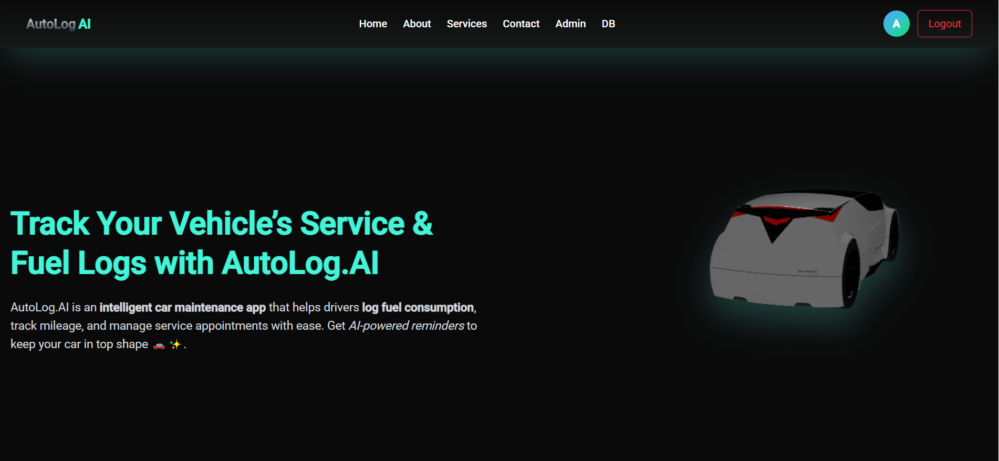

### 🔐 Authentication  
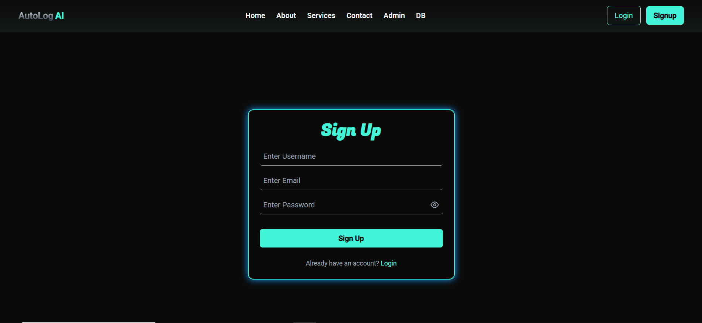  
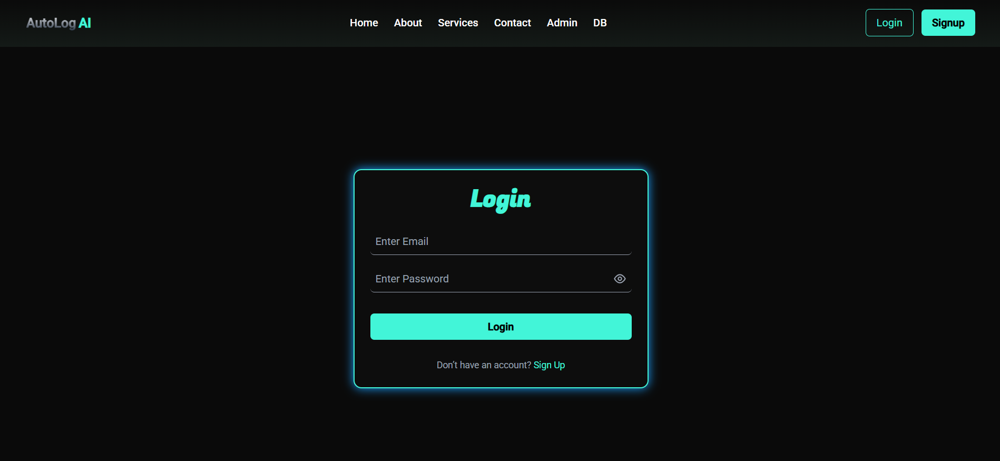  
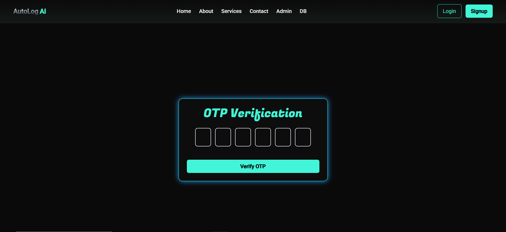

### 📋 User Dashboard  

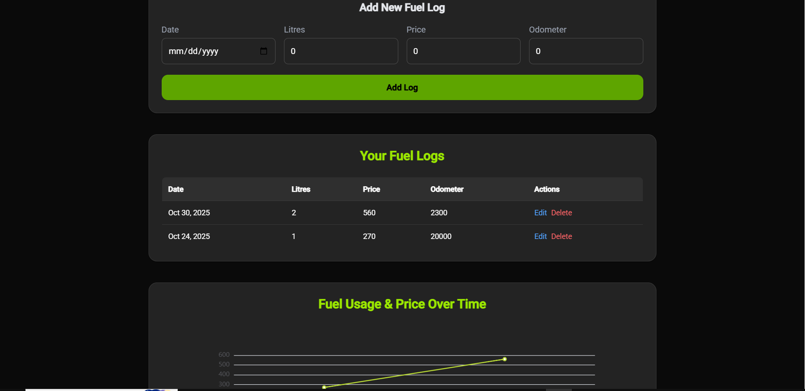  
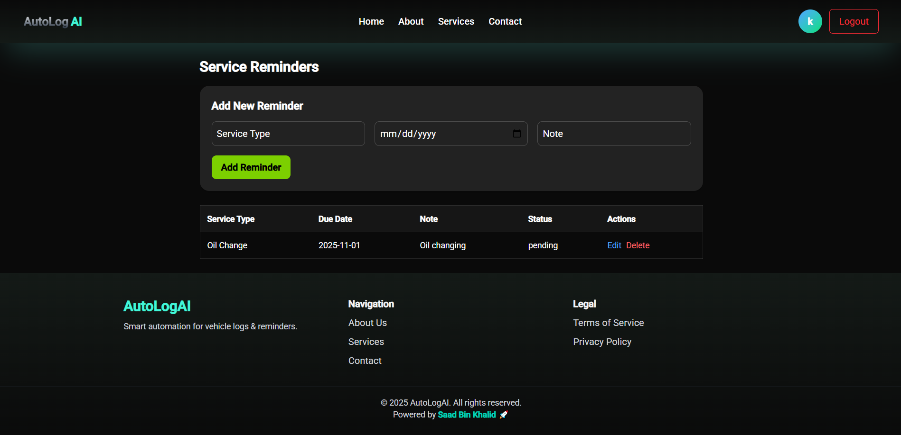

### 🤖 AI Assistant (Nex)  
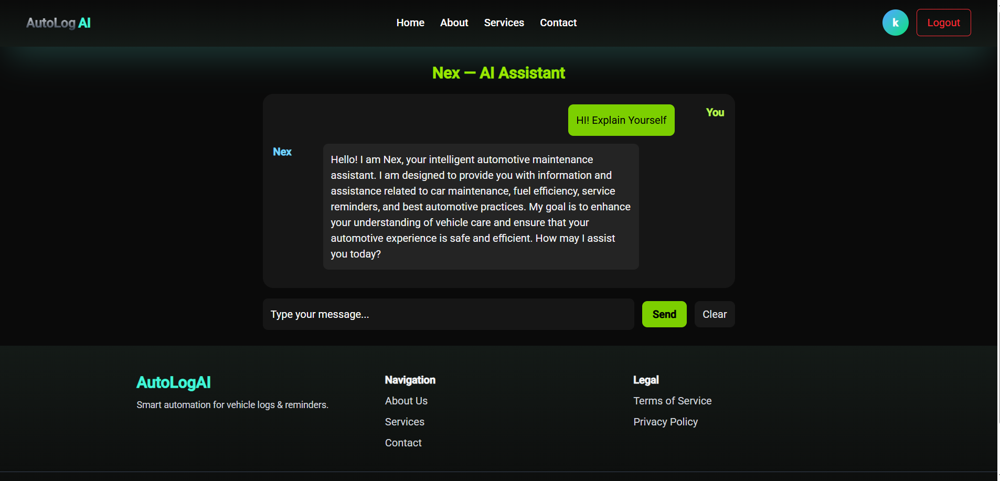

### 🧾 OCR Upload  
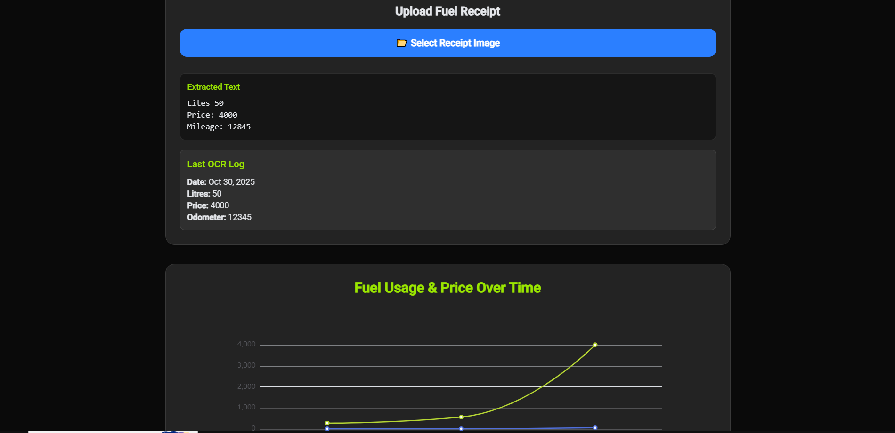

### ⚙️ Admin Panel  
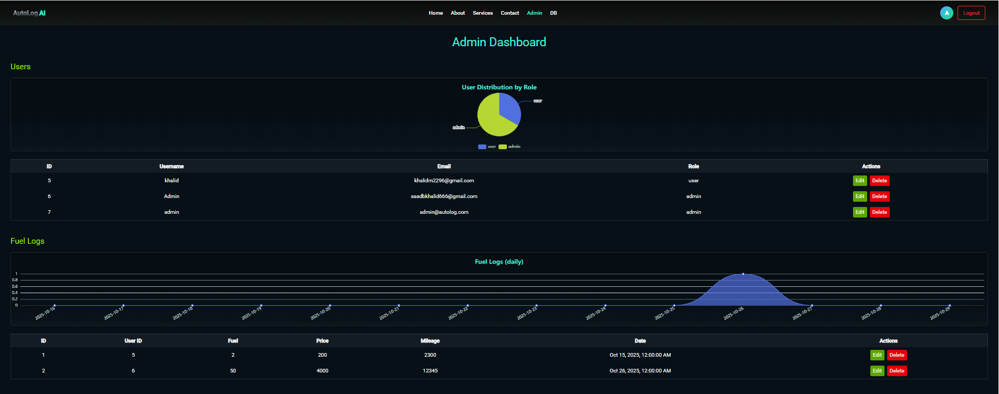  
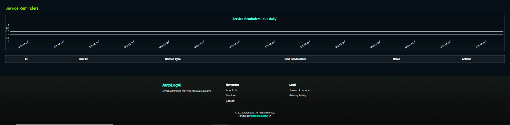

### 📜 Legal Pages  
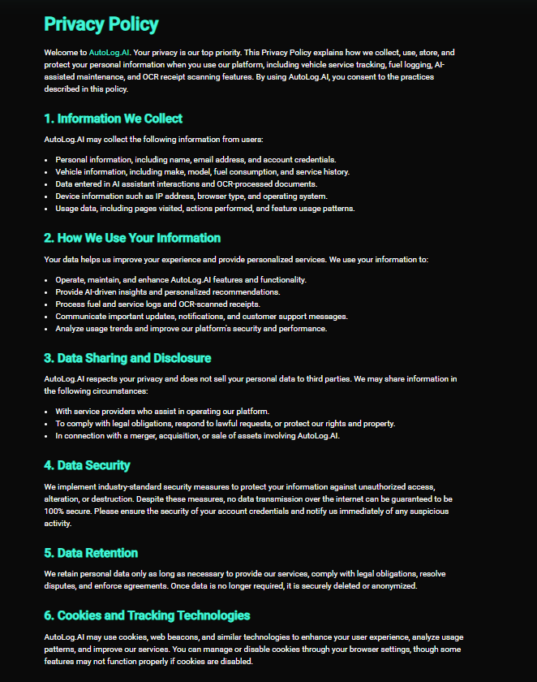  
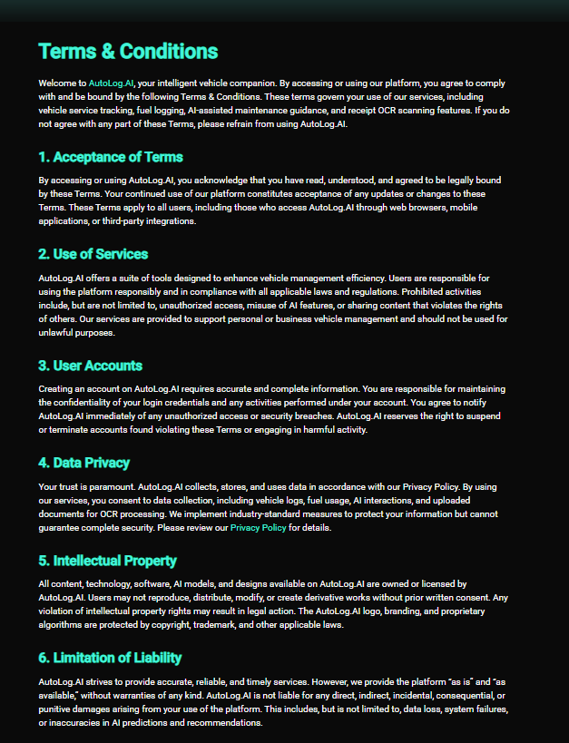  
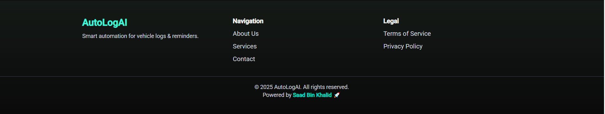

---

## 🚀 Getting Started  

### 🧭 Clone the Repository  
```bash
git clone https://github.com/your-username/AutoLogAI.git
cd AutoLogAI
